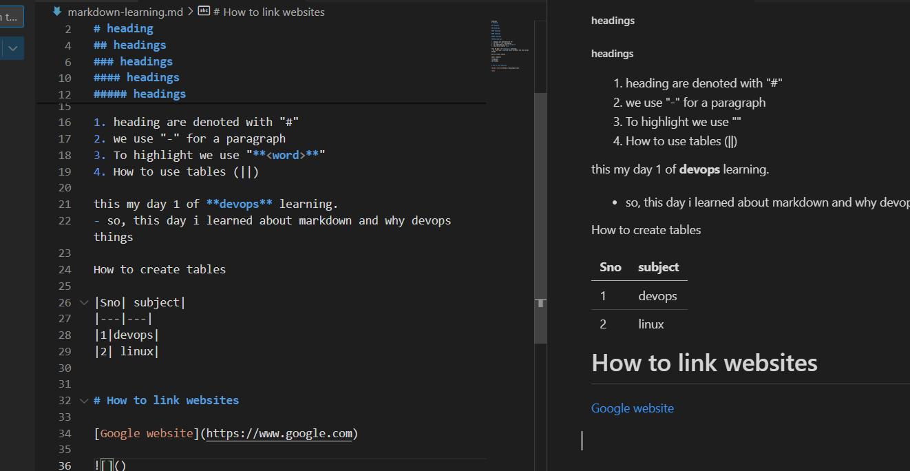

Markdown learning
-------

1. heading are denoted with "#"
2. we use "-" for a paragraph
3. To highlight we use "**<word>**"
4. How to use tables (||)
5. Hyperlink of websites
6. Hyperlink of images
7. code block mentioning
8. hyperlinking within a file


headings


 [heading](#devops-basics)

 [os](#operatingsystem)

## headings

### headings

#### headings

#### headings

##### headings

###### headings


this my day 1 of **devops** learning.
- so, this day i learned about markdown and why devops things

How to create tables

|Sno| subject|
|---|---|
|1|devops|
|2| linux|

## heading


# How to link websites

[Google website](https://www.google.com)



code block highlighting

```
Hi this is devoops learning
day 1
Started with devopse
what is devops
devops fundamentals

```

# operatingsystem

### devops basics